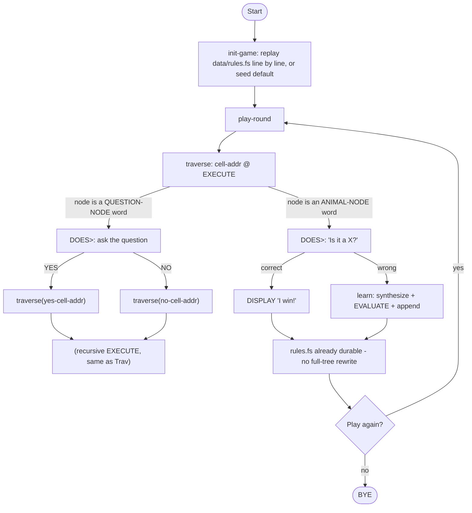
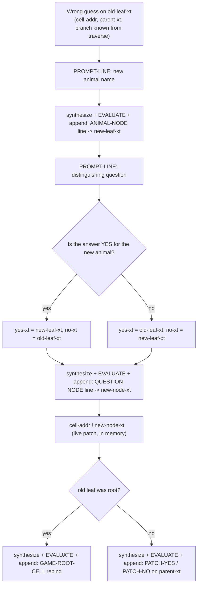
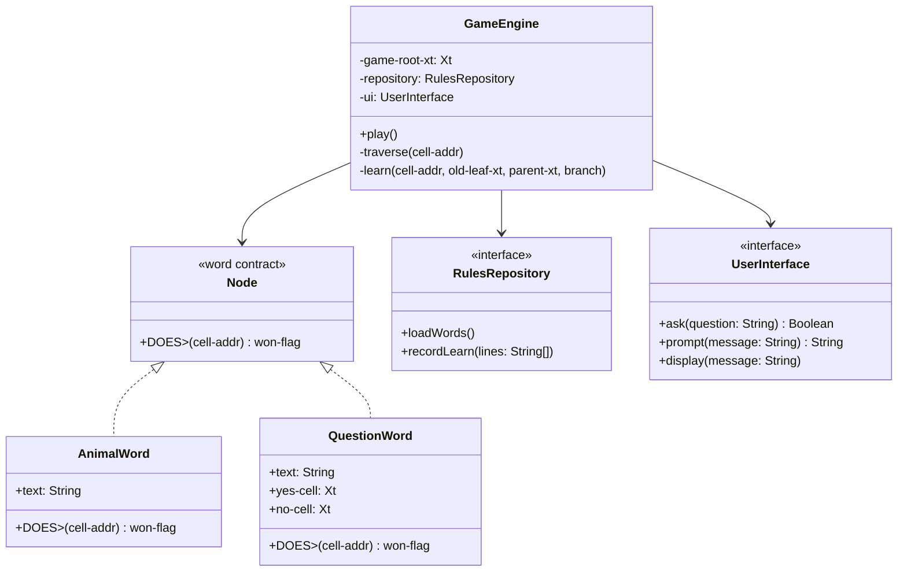
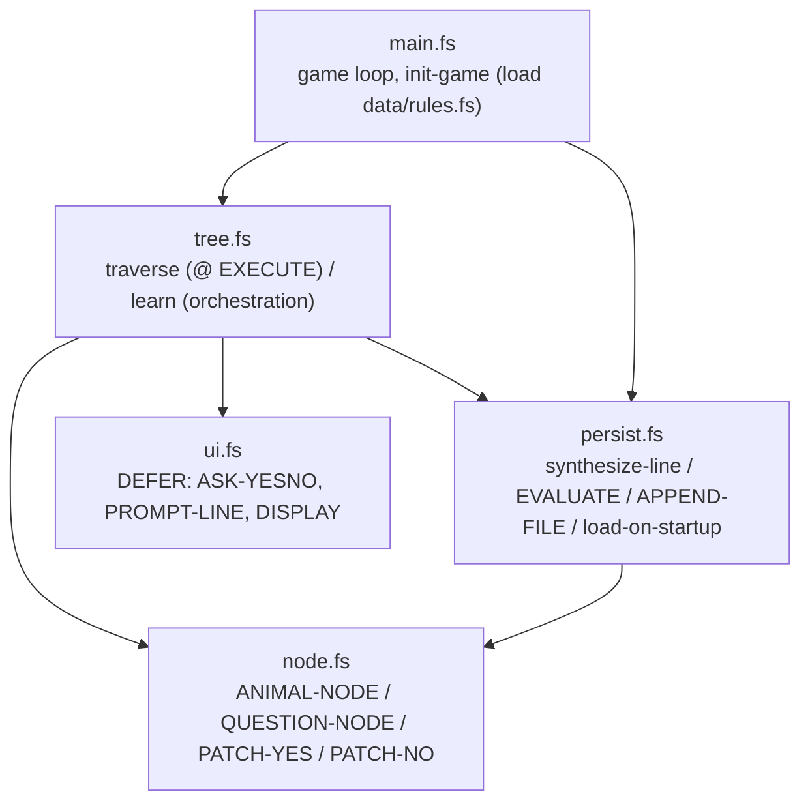
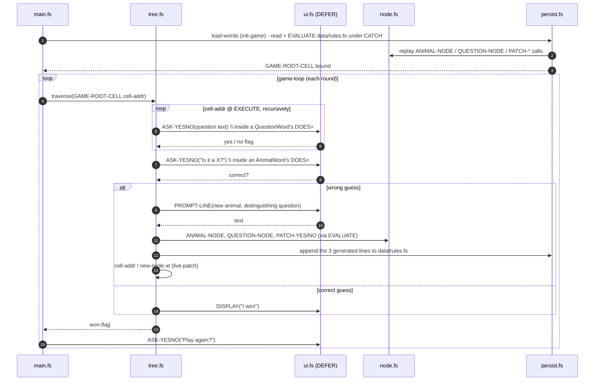

# Animal Game V2

**"Animal Game V2"** - a self-learning guessing game backed by a binary
decision tree that grows through gameplay, where the tree itself lives
*inside the Forth dictionary*: every learned animal and question becomes a
live Forth word, and the save file is Forth source that rebuilds those
words on load.

---

## Table of Contents

1. [Overview](#overview)
2. [Core Concept](#core-concept)
3. [Data Structure: Node-as-Word](#data-structure-node-as-word)
4. [Game Loop](#game-loop)
5. [Learning Algorithm](#learning-algorithm)
6. [Persistence](#persistence)
7. [Project Structure](#project-structure)
8. [Domain Model](#domain-model)
9. [Forth Implementation](#forth-implementation)
10. [User Interactions](#user-interactions)
11. [Acceptance Criteria](#acceptance-criteria)
12. [Constraints & Non-Functional Requirements](#constraints--non-functional-requirements)

---

## Overview

The game starts knowing nothing (or just one animal) and learns new
animals from the player every time it guesses wrong. Over many sessions it
grows into a rich knowledge base built entirely from human input.

Instead of a struct with a type tag, a node is a `CREATE...DOES>` Forth
word whose behavior - ask-and-branch, or guess-and-maybe-learn - is baked
in at definition time. There is no `node-leaf?` runtime check anywhere in
the traversal path; the dictionary already knows what each word does.

Persistence follows the same shift: instead of a custom parser, `learn`
synthesizes a few lines of literal Forth source (calls to the node factory
words), `EVALUATE`s them immediately to update the live dictionary, and
appends the *same* text to `data/rules.fs`. On the next launch, the file is
read back one line at a time and each line is `EVALUATE`d - interpreting
the file *is* rebuilding the tree. No custom deserializer exists - only a
two-line read loop.

---

## Core Concept

The game starts with a single question (e.g., *"Is it a mammal?"*). Every
**Yes** or **No** answer leads to either another question node or a
terminal guess (a *leaf node*).

The cool part is how it **learns**:

| Scenario | What happens |
|---|---|
| Game guesses correctly | "I win!" - round ends |
| Game guesses wrong (e.g., guesses *Dog*, player thought *Wolf*) | Game asks for a distinguishing question |
| Player provides question (e.g., *"Does it live in the wild?"*) | A new question word is created; *Wolf* becomes its yes-child, *Dog* becomes its no-child, and the slot that used to hold *Dog* now points at the new question |

Over time, a completely blank program grows into a massive database of
animal knowledge just by playing with humans.

---

## Data Structure: Node-as-Word

Every node is a dictionary word created by one of two factory words. The
word's `DOES>` action *is* its traversal behavior - executing the word
walks its own subtree and leaves a `won-flag`.

```
ANIMAL-NODE   ( c-addr u "name" -- )     defines a leaf word
  DOES>       ( cell-addr -- won-flag )  ask "Is it a <name>?"; guess or learn

QUESTION-NODE ( yes-xt no-xt c-addr u "name" -- )   defines an interior word
  DOES>       ( cell-addr -- won-flag )  ask the question; traverse into
                                          the yes-child or no-child cell
```

An interior word's yes/no children are **mutable cells inside its own
body** (captured from `yes-xt`/`no-xt` at creation time, rebindable
later). A third word rebinds one of those cells without redefining the
node:

```
PATCH-YES ( new-child-xt parent-xt -- )   rebind parent's yes-cell
PATCH-NO  ( new-child-xt parent-xt -- )   rebind parent's no-cell
```

`GAME-ROOT-CELL` is a plain `VARIABLE` holding the current root's
execution token.

### Example

```forth
S" Dog"  ANIMAL-NODE   NODE-0                 \ default seed leaf
' NODE-0 GAME-ROOT-CELL !

\ learn: Wolf vs Dog, distinguished by "Does it live in the wild?"
S" Wolf" ANIMAL-NODE   NODE-1
' NODE-1 ' NODE-0 S" Does it live in the wild?" QUESTION-NODE NODE-2
' NODE-2 GAME-ROOT-CELL !                        \ old leaf (NODE-0) was root
```

(`ANIMAL-NODE`/`QUESTION-NODE` parse their defining name directly via
`CREATE`, so it's a bare token - `NODE-0`, not `CONSTANT NODE-0`. A leading
`'` is needed wherever a line passes an *already-defined* node's execution
token as an argument, since a bare reference would execute that node
instead of pushing its xt.)

Word **names** (`NODE-0`, `NODE-1`, …) are always synthesized from an
incrementing counter - never derived from player text. Player text (animal
names, questions) only ever appears as the payload of an `S" ..."`
literal. This separation is the basis of the injection guard in
[Persistence](#persistence).

---

## Game Loop

`traverse` collapses to a single fetch-and-execute because each node's
`DOES>` already knows its own type.



There is no separate "save the tree" step after every round. Learning *is*
the write - a correct-guess round has nothing new to persist, so nothing
is written.

---

## Learning Algorithm

Triggered when the game guesses wrong.

**Inputs collected from player:**
1. The correct animal name (e.g. *"Wolf"*)
2. A yes/no question that distinguishes the new animal from the guessed one (e.g. *"Does it live in the wild?"*)
3. Whether the answer to that question is YES or NO for the new animal

**Tree mutation**, expressed as word synthesis instead of a struct patch:

```
Before:                     After:
  NODE-0 = [Dog]          NODE-2 = [Does it live in the wild?]
  (held by some cell)       ├── YES → NODE-1 = [Wolf]
                             └── NO  → NODE-0 = [Dog]
  the holding cell now points at NODE-2 instead of NODE-0
```

**Pseudocode:**

```
function learn(cellAddr, oldLeafXt, parentXt, oldLeafWasYesBranch):
    newLeafXt = synthesize `S" <name>" ANIMAL-NODE NODE-<n>`, EVALUATE, append
    (yesXt, noXt) = newAnimalIsYes ? (newLeafXt, oldLeafXt) : (oldLeafXt, newLeafXt)
    newNodeXt = synthesize `<yesXt> <noXt> S" <question>" QUESTION-NODE NODE-<n+1>`,
                EVALUATE, append
    cellAddr ! newNodeXt                          \ live: patch in place
    if parentXt = NIL:                              \ old leaf was the root
        synthesize `NODE-<n+1> GAME-ROOT-CELL !`, EVALUATE, append
    else:
        branchWord = oldLeafWasYesBranch ? PATCH-YES : PATCH-NO
        synthesize `NODE-<n+1> <parentXt> <branchWord>`, EVALUATE, append
```

Every `learn` call therefore appends **exactly three lines** to
`data/rules.fs`: one `ANIMAL-NODE` definition, one `QUESTION-NODE`
definition, and one rebind (`GAME-ROOT-CELL !` the first time ever; a
`PATCH-YES`/`PATCH-NO` call every time after, since the root is a leaf only
until the very first learn and is a question-node from then on).

**Control flow:**



---

## Persistence

The tree must survive between sessions. The save file is **executable
Forth source**, appended to incrementally, never rewritten in full:

```forth
S" Dog"  ANIMAL-NODE NODE-0
' NODE-0 GAME-ROOT-CELL !
S" Wolf" ANIMAL-NODE NODE-1
' NODE-1 ' NODE-0 S" Does it live in the wild?" QUESTION-NODE NODE-2
' NODE-2 GAME-ROOT-CELL !
S" Parrot" ANIMAL-NODE NODE-3
' NODE-3 ' NODE-0 S" Does it have feathers?" QUESTION-NODE NODE-4
' NODE-4 ' NODE-2 PATCH-NO
```

(Word names are the defining tokens `ANIMAL-NODE`/`QUESTION-NODE` parse
directly via `CREATE` - not `CONSTANT`s bound to a separately-tracked xt.
A leading `'` is required wherever a line needs an already-defined node's
*execution token* as an argument, since bare `NODE-3` would execute it
rather than push its xt.)

- **Load** (`data/rules.fs` present): `load-words` reads the file with
  plain `OPEN-FILE`/`READ-LINE` and `EVALUATE`s each line in turn - not
  gforth's `INCLUDED`, whose relative-path resolution goes through its own
  search path rather than the process's working directory, and so can
  silently fail to find the exact same relative path `OPEN-FILE` finds
  without issue. This replays every `ANIMAL-NODE` / `QUESTION-NODE` /
  `PATCH-YES` / `PATCH-NO` / `GAME-ROOT-CELL !` call in the order they were
  originally learned, rebuilding the dictionary - and with it,
  `GAME-ROOT-CELL` ends up correctly bound to the last root that was ever
  set. A thrown exception (malformed source, e.g. from manual editing) is
  caught, and the game falls back to the default seed tree.
- **Load** (file absent/empty): `seed-default` calls the exact same
  `persist-new-animal`/`persist-set-root` words a real learn would, with
  `"Dog"` as the text - so the bootstrap goes through the identical
  EVALUATE-and-append pipeline as everything else, and `data/rules.fs`
  exists with the seed animal in it from the very first launch, not only
  after the first real learn.
- **Save**: there is no "save the whole tree" word. Each `learn` call
  appends its three generated lines with `APPEND-FILE`/`WRITE-LINE` as
  part of the learning step itself (see
  [Learning Algorithm](#learning-algorithm)). A correct-guess round
  performs no file I/O at all.
- **Counter continuity**: the `NODE-<n>` counter is a `VARIABLE` bumped
  inside `ANIMAL-NODE`/`QUESTION-NODE` themselves, so replaying
  `data/rules.fs` on startup naturally leaves the counter positioned to
  continue numbering from where the previous session left off - no separate
  bookkeeping line is needed.

### Injection guard

Player-supplied text (animal name, question) is embedded inside `S" ..."`
literals in the generated source. `S" ... "` in gforth terminates on the
next `"` character - an animal name or question containing an embedded `"`
would close the string early and let the remainder parse as arbitrary Forth,
both in the immediate `EVALUATE` and in every future replay of the file.

**Mitigation (mandatory, not optional):** reject any learned string
containing `"` at the point of collection (`PROMPT-LINE`'s caller in
`learn`), before it is ever passed to `EVALUATE` or `APPEND-FILE`. Re-prompt
the player for a replacement, the same way `ASK-YESNO` already re-prompts on
invalid yes/no input. This is the single load-bearing safety control in the
whole design - everything else about "data becomes code" is safe *only*
because word names are always synthesized internally and never derived from
player text.

### Alternative considered and rejected

A full gforth VM image snapshot (`gforth --image-file` / `SAVE-SYSTEM`-style
facilities) would avoid re-parsing text on load entirely, but ties the save
file to the exact interpreter binary/version and isn't diffable or
hand-editable. Rejected as the primary mechanism; could be revisited later
as an optional derived fast-load cache, never as the source of truth.

---

## Project Structure

```
AnimalGameV2/
├── src/
│   ├── node.fs        # ANIMAL-NODE / QUESTION-NODE / PATCH-YES / PATCH-NO
│   ├── ui.fs           # abstract I/O layer (DEFER words + defaults)
│   ├── tree.fs         # traversal (`@ EXECUTE`) and learning orchestration
│   ├── persist.fs      # synthesize-line / EVALUATE / append / load-on-startup
│   └── main.fs         # entry point and game loop
├── tests/
│   ├── test-node.fs
│   ├── test-tree.fs
│   ├── test-persist.fs
│   ├── test-ui.fs
│   └── integration/     # two-process persistence round-trip
├── data/               # data/rules.fs, created at runtime, append-only
├── docs/
│   └── AnimalGameV2.md
├── Makefile
└── README.md
```

---

## Domain Model



---

## Forth Implementation

This design is realized in **Forth (gforth)** across five source modules:

| Spec concept                          | Forth module        |
|---------------------------------------|----------------------|
| `Node` (`AnimalWord`, `QuestionWord`) | `src/node.fs`        |
| `UserInterface`                       | `src/ui.fs`          |
| `GameEngine` traversal + learning     | `src/tree.fs`        |
| `RulesRepository`                     | `src/persist.fs`     |
| entry point / game loop               | `src/main.fs`        |

### Module dependencies



`tree.fs` depends on `persist.fs` directly, so `learn` can trigger the
synthesize/EVALUATE/append step itself as part of learning, rather than a
separate save step run by `main.fs` after the round.

### Runtime flow (one round)



### Public words

**`node.fs`**:
- `ANIMAL-NODE ( c-addr u "name" -- )` - defines `name`; `DOES> ( cell-addr -- won-flag )` asks "Is it a `<name>`?" and either wins or calls `learn`
- `QUESTION-NODE ( yes-xt no-xt c-addr u "name" -- )` - defines `name`; body holds text + two mutable child cells; `DOES> ( cell-addr -- won-flag )` asks the question, then `traverse`s into the chosen child cell
- `PATCH-YES ( new-child-xt parent-xt -- )` / `PATCH-NO ( new-child-xt parent-xt -- )` - rebind one child cell of an already-defined `QUESTION-NODE` word
- `node-counter` - `VARIABLE`, bumped by every `ANIMAL-NODE`/`QUESTION-NODE` call, source of the `NODE-<n>` suffix
- `node-leaf? ( xt -- flag )` - introspection only (mainly for tests); traversal itself never inspects it

**`ui.fs`** - all user I/O via three `DEFER` words, with `ACCEPT`/`TYPE`-backed
defaults; tests override them with scripted answers:
- `ASK-YESNO ( c-addr u -- flag )`
- `PROMPT-LINE ( c-addr u -- c-addr2 u2 )`
- `DISPLAY ( c-addr u -- )`
- `classify-yn ( c-addr u -- yes-flag valid-flag )`

**`tree.fs`**:
- `traverse ( cell-addr -- won-flag )` - `-1 FALSE dispatch-node` (no type dispatch; each node's `DOES>` already knows what to do)
- `learn ( cell-addr old-leaf-xt parent-xt branch-is-yes -- )` - collects the three inputs (rejecting embedded `"`), synthesizes and evaluates the `ANIMAL-NODE`/`QUESTION-NODE`/rebind lines, appends them via `persist.fs`, and patches `cell-addr` live

**`persist.fs`**:
- `load-words ( -- )` - reads and `EVALUATE`s `data/rules.fs` line by line if present and non-empty, else runs the default-seed bootstrap; wrapped in `CATCH`, falling back to the default seed on any thrown error
- `persist-new-animal ( c-addr u -- xt )` / `persist-new-question ( yes-xt no-xt c-addr u -- xt )` / `persist-set-root ( xt -- )` / `persist-patch-yes` / `persist-patch-no` - each synthesizes a line, `EVALUATE`s it, and appends it to `data/rules.fs`
- `contains-quote? ( c-addr u -- flag )` - the injection guard's predicate; `learn` re-prompts when it's `TRUE`

**`main.fs`** - `init-game` (calls `load-words`), `play-round`, `game-loop`,
`run-game` (ends with `run-game BYE`).

### Key design decisions

- **DOES> replaces type dispatch.** There is no `node-leaf?` check anywhere
  in the traversal path - the word created by `ANIMAL-NODE` vs
  `QUESTION-NODE` already encodes its own behavior. `traverse` is one line.
- **Cell-address threading, extended.** `learn` needs `cell-addr` (to patch
  a parent pointer with one `!`), `parent-xt`, and the branch flag, because
  it also needs to *name* the parent in a replayable `PATCH-YES`/`PATCH-NO`
  line - the live patch alone isn't enough once persistence must be
  replayable.
- **One generation step, two sinks.** Each learned line of Forth source is
  produced once, then both `EVALUATE`d (live effect) and appended (durable
  effect) - the save file is never a separate serialization of the tree, it
  is the literal record of what was evaluated.
- **DEFER-based UI interface.** `ui.fs`'s three words remain `DEFER`, so
  tests swap in scripted answers without a terminal. Persistence uses
  `persist-new-animal`/`persist-new-question`/`load-words` as its own seam
  instead, fakeable the same way in `tree.fs`'s tests.
- **Graceful degradation.** Invalid yes/no input re-prompts; a missing,
  empty, or corrupt `data/rules.fs` falls back to the default seed instead
  of crashing or leaving a half-built dictionary.
- **Word names are never player text.** The only guard the design truly
  depends on - see [Injection guard](#injection-guard).

### Implementation notes (Forth gotchas)

Forth's explicit data stack and gforth's own file-resolution quirks make a
few mistakes easy; these bit the actual build and are worth remembering:

- **`>R … R>` only inside a definition.** At the top-level interpreter the
  return stack is in use between words, so a value parked with `>R` across
  interpreted lines is clobbered (invalid-address crash). Keep `>R … R>`
  within a single colon definition - this bit a test file that tried to
  hold a fileid on the return stack across three separately-interpreted
  top-level lines.
- **`INCLUDED` doesn't resolve a relative path like `OPEN-FILE` does.**
  gforth's `INCLUDED` walks its own file-search path, not the process's
  current working directory, so it can silently fail to find the exact
  same relative string plain `OPEN-FILE` finds without issue. `load-words`
  reads `data/rules.fs` with `OPEN-FILE`/`READ-LINE`/`EVALUATE` instead -
  the same mechanism `append-line` already uses - so path resolution is
  consistent everywhere in `persist.fs`.
- **A 0-byte file is not the same as a missing one.** `INCLUDED`/`EVALUATE`
  on an empty file "succeeds" without throwing, which means it also never
  seeds a default tree - `load-words` must explicitly check the file's
  size, not just its existence, or a freshly-created empty save file leaves
  `GAME-ROOT-CELL` unbound.
- **`CREATE`'s name must be the next literal token in the input stream.**
  A defining word like `ANIMAL-NODE` can't be called mid-line inside
  another colon definition and expect the following token to become the
  new word's name - that only works when it's interpreted directly (a
  top-level line, or text passed to `EVALUATE`), which is exactly why
  `learn` builds and `EVALUATE`s a line of source rather than calling
  `ANIMAL-NODE` as an ordinary compiled call.
- **`CREATE...DOES>` bodies are never freed.** There is no reclamation
  story for dictionary words - accepted as a known limit (see
  [Constraints](#constraints--non-functional-requirements)), not something
  this design attempts to solve.
- **`APPEND-FILE`/`WRITE-LINE` ordering matters for crash-safety.**
  `EVALUATE` the generated lines *before* appending them to disk (not the
  reverse) - if evaluation itself throws (e.g. a `PATCH-YES` argument is
  stale), nothing corrupt has been written to `data/rules.fs` yet.

---

## User Interactions

### Traversal prompt

```
Does it have four legs? (yes/no): _
```

### Guess prompt

```
Is it a Dog? (yes/no): _
```

### Learning prompts (on wrong guess)

```
I give up!  What animal were you thinking of?
Animal name:  _
Give me a yes/no question that tells the new animal from my guess:
Question:  _
For the new animal, is the answer to your question YES?  (yes/no): _
```

If the animal name or question contains a `"` character, the injection
guard adds one more prompt before continuing:

```
That text can't contain a " character - please try again.
Animal name:  _
```

### Play again

```
Would you like to play again? (yes/no): _
```

---

## Acceptance Criteria

- [x] Game starts from a single default animal if `data/rules.fs` does not exist
- [x] Game correctly traverses the tree and guesses based on player answers, via `cell-addr @ EXECUTE`
- [x] On a correct guess, the game announces its win and offers another round, with no file write
- [x] On a wrong guess, the game collects the three learning inputs and both evaluates and appends the generated definitions
- [x] Learned animals are queryable immediately in the same session (no restart needed) via the live `EVALUATE`
- [x] On next launch, replaying `data/rules.fs` reflects all previously learned animals, including ones learned deep in the tree (not just at the root)
- [x] Invalid yes/no input is re-prompted until valid
- [x] Animal names or questions containing `"` are rejected and re-prompted before ever reaching `EVALUATE` or the save file
- [x] The game handles a missing, empty, or corrupt `data/rules.fs` gracefully (falls back to the default seed, via `CATCH`)
- [x] All core logic (traversal, learning, word synthesis, patching) is covered by unit tests, with persistence fakeable for I/O-free tests
- [x] A two-process integration test proves persistence survives a real restart, not just a live `EVALUATE` within one process

---

## Constraints & Non-Functional Requirements

| Concern | Requirement |
|---|---|
| **Architecture** | `GameEngine` (`tree.fs`) must not depend on concrete I/O - depend on `ui.fs`'s `DEFER` words and `persist.fs`'s repository-style entry points |
| **TDD** | All domain and engine logic written test-first |
| **SOLID** | Single-responsibility per module; `node.fs` changes are isolated from `ui.fs` and from `tree.fs`'s orchestration logic |
| **No frameworks** | Core logic must be pure domain code with zero framework dependencies |
| **Question format** | All question nodes must end with `"?"` - validated on input |
| **Injection safety** | Learned text must never contain `"` before reaching `EVALUATE` or `APPEND-FILE` - this is a hard requirement, not a nice-to-have |
| **Dictionary growth** | Unbounded and non-reclaimable; acceptable for tens to low hundreds of learned animals per the game's expected scale |
| **Performance** | Tree traversal is O(depth) via direct `EXECUTE` |
| **Encoding** | `data/rules.fs` is UTF-8 Forth source; animal names and questions support Unicode, subject to the `"`-rejection guard |
